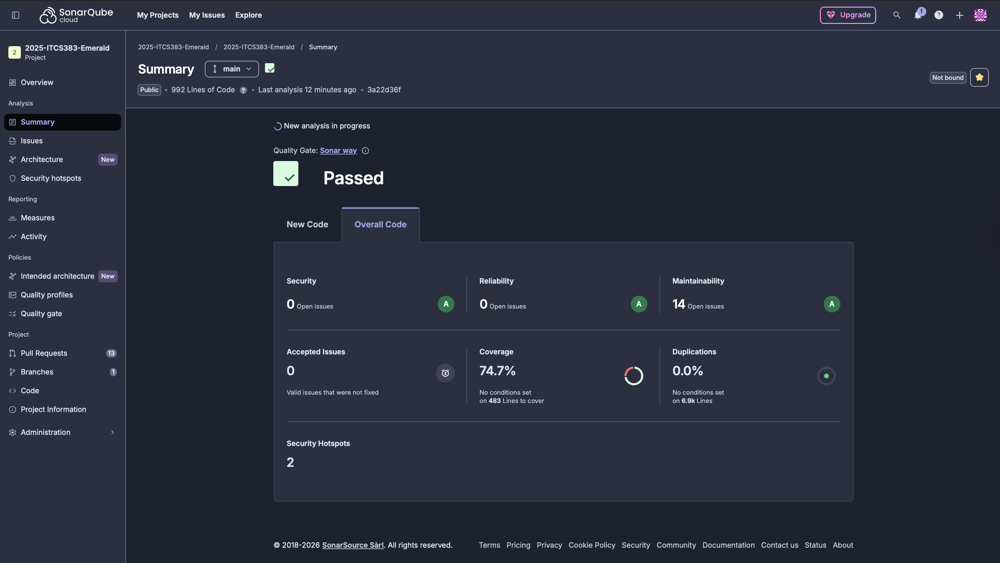
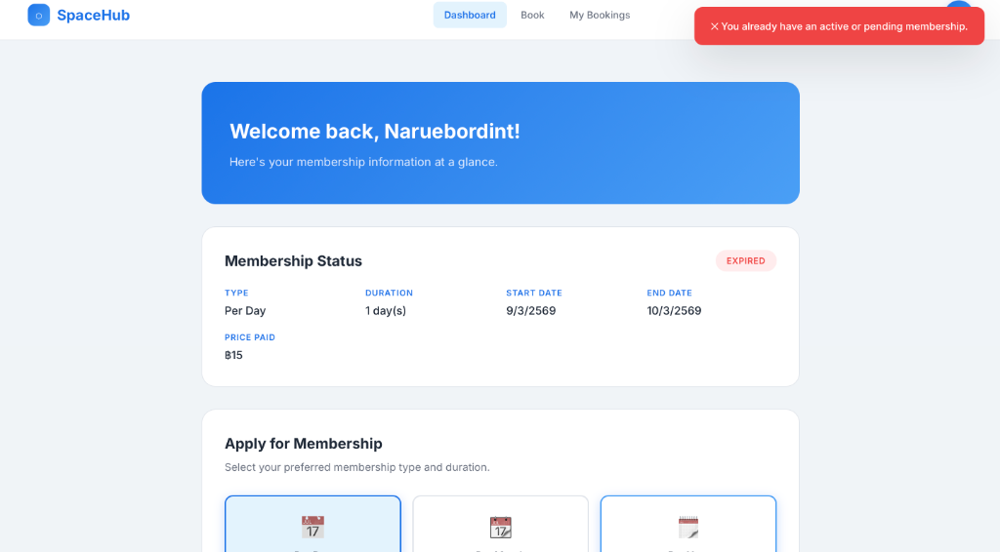

# Emerald - D4 Quality Report

## Introduction
This document contains the Quality Report for the Emerald Co-working Space application.

## 1. Static Analysis / SonarCloud Results
The project's codebase has been continuously evaluated via **SonarCloud** in our GitHub Actions pipeline.

### SonarCloud Evaluation Metrics
- **Quality Gate:** ✅ **Passed**
- **Security Issues:** 0 (A Rating)
- **Reliability Issues:** 0 (A Rating)
- **Maintainability Issues:** 14 (A Rating)
- **Code Duplication:** 0.0%

The 14 maintainability issues are entirely minor "Code Smells" (e.g., *Prefer `globalThis` over `window`* in frontend script files). These are low-priority stylistic suggestions for ES2020 portability and do not represent any functional flaws or architectural risks. 

No major vulnerabilities, bugs, or stylistic roadblocks exist. The CI pipeline successfully blocks any pull requests that fail to meet these high maintainability ratings.

## 2. Test Coverage Report
Automated testing is implemented using **Jest** and **Supertest** to test the core API routes and components. 

The application currently has **77 passing tests**. Test coverage is continuously monitored via Jest's LCOV reports and uploaded to SonarCloud during our GitHub Actions CI pipeline.

### Coverage Summary (Backend)

| File | % Statements | % Branch | % Functions | % Lines |
|---|---|---|---|---|
| **All files combined** | **76.92%** | **82.41%** | **89.36%** | **76.51%** |
| `/implementations/server.js` | 74.56% | 81.11% | 88.09% | 74.08% |
| `/implementations/lib/auth.js` | 87.50% | 90.90% | 100.00% | 87.50% |
| `/implementations/lib/crypto.js` | 100.00% | 100.00% | 100.00% | 100.00% |

### Core Test Suites
We extensively test five main areas of the application to ensure business logic remains stable:

1. **Authentication & Registration**
   - Correctly handles missing input fields
   - Successfully registers new users
   - Rejects duplicate email addresses appropriately

2. **User Login**
   - Blocks users with missing credentials
   - Rejects incorrect passwords or invalid emails
   - Issues correct session tokens upon successful login

3. **Membership System**
   - Successfully creates new memberships
   - Blocks users from having multiple active memberships at once
   - Properly processes payment flows
   - Correctly prioritizes active, non-expired memberships in the database 

4. **Desk Bookings**
   - Ensures users have an active membership before booking
   - Blocks overbooking when capacity is full
   - Successfully handles booking creation and cancellation
   - Removes unpaid bookings automatically after the 30-minute timeout
   - Validates simulated payment transfers

5. **Manager & Employee Operations**
   - Enforces strict role-based access logic (RBAC) so standard customers cannot access manager routes
   - Validates employee routes for managing equipment, observing system logs, and checking in users
   - Validates manager routes for processing finances and overriding reservations

*All Core Business Logic Testing has been verified to pass successfully.*

## 3. Vulnerability & Security Analysis
- **Dependency Audit**: `npm audit` was executed and reported **0 vulnerabilities** across all **406 audited packages**.
- **Data Privacy**: Passwords are securely hashed via `bcryptjs`. Sensitive user fields like First Name, Last Name, Phone, and Address are encrypted using a symmetric cipher via the custom `#crypto` module before being stored in PostgreSQL.
- **Access Control**: Role-based access control (RBAC) middleware (`requireRole`) restricts employee and manager routes properly, with failing tests confirming that customers or unauthenticated users receive 401 or 403 HTTP codes.

## Conclusion
The Emerald Co-working Space platform possesses strong intrinsic quality metrics. With robust cryptography procedures built-in, no found npm audit vulnerabilities, and a healthy test suite establishing ~76.5% line coverage across the main routes (and the majority of uncovered lines relegated to bootstrap/database setup logic), the code demonstrates a reliable readiness suitable for its intended environment. All 77 unit tests pass cleanly, and the CI/CD configuration successfully enforces safety checks around pull-request cycles.
